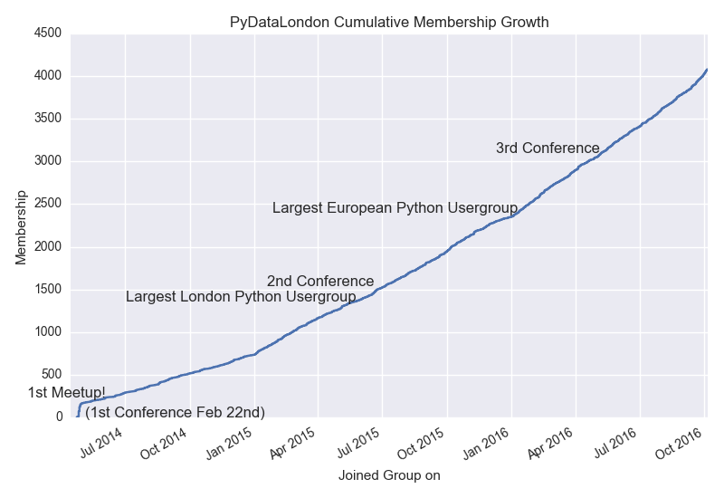

# PyDataLondon cumulative membership growth
Plots cumulative growth of a meetup group with annotations

As a Meetup group admin go to "Members|Download membership list" and run:

    $ python plot_meetup_cumulative_growth.py <meetupfile.xls>

You'll get an output like:



NOTE the python file has an embedded list of dates for our meetup group, you'll want to edit/remove these.

Which might look like:

    $ python plot_meetup_cumulative_growth.py PyData-London-Meetup_Member_List_on_07-30-15.xls

The meetup .xls file looks like this (only Admins can download them):

```
Name	User ID	Title	Member ID	Location	Joined Group on	Last visited group on	Last Attended	Total RSVPs	RSVPed Yes	RSVPed Maybe	RSVPed No	Meetups attended	No shows	Intro	Photo	Assistant Organizer	Mailing List	URL of Member Profile
Ian Ozsvald	user 12537919		12537919	London	04/24/2014	06/22/2015	06/20/2015	 14	14	0	0	13	0	Yes	Yes	Yes	No	http://www.meetup.com/PyData-London-Meetup/members/12537919/ 
...
```
